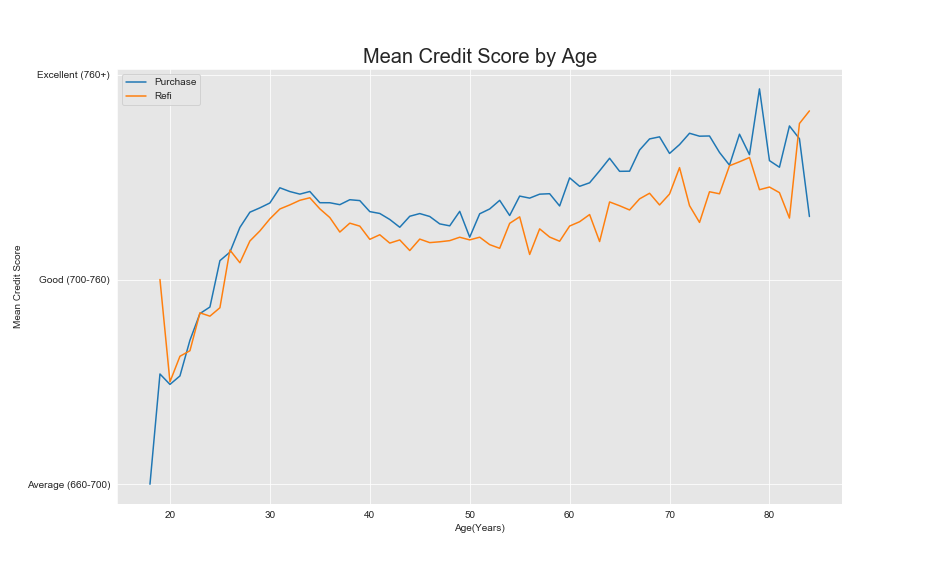

# Mortgage Classification

## Problem Statement
Mortgage data is dense and difficult to easily navigate.  A simple understanding of mortgages and their properties isn't enough to process all the data.  Using supervised and unsupervised learning, classify the dataset by the type of mortgage product and use the feature importances to pick out the important pieces.

## Data
The data in this repo came from https://www.fhfa.gov/DataTools/Downloads/Pages/FHLBank-Public-Use-Database-Previous-Years.aspx 

This website houses pertinent public use data that relates to mortgages for the given year.  For this project the 2018 data was chosen.  The column definitions are available in AMA_PUDB_definitions_2018.pdf.  The definitions describe the property's geography and census information, borrowers income, demographics, and the properties of the mortgage.  In total there are over 65,000 mortgages that are detailed by 82 features.

## Strategy
Upon first look, there are multiple categorical features.  Usually, simply encoding these features with dummy variables is simple enough to handle the problem.  In this case, however, since there are so many different values in each category, creating dummy variables is going to explode the dimensionality of the dataset.  Unsupervised learning has a couple methods that can help with the problems with dimensionality.  This project is going to showcase those methods and how to use them to engineer features for a supervised learning problem.

## Results

The ROC-curve shows that the test data generalized nicely and that the model predicted true positives with a satisfactory frequency.

One of the important features was the borrower's credit score.  Here it is showcased by the borrower's age.  You can see how they trend similarily but there is a distinction in credit score between purchase and refi.

